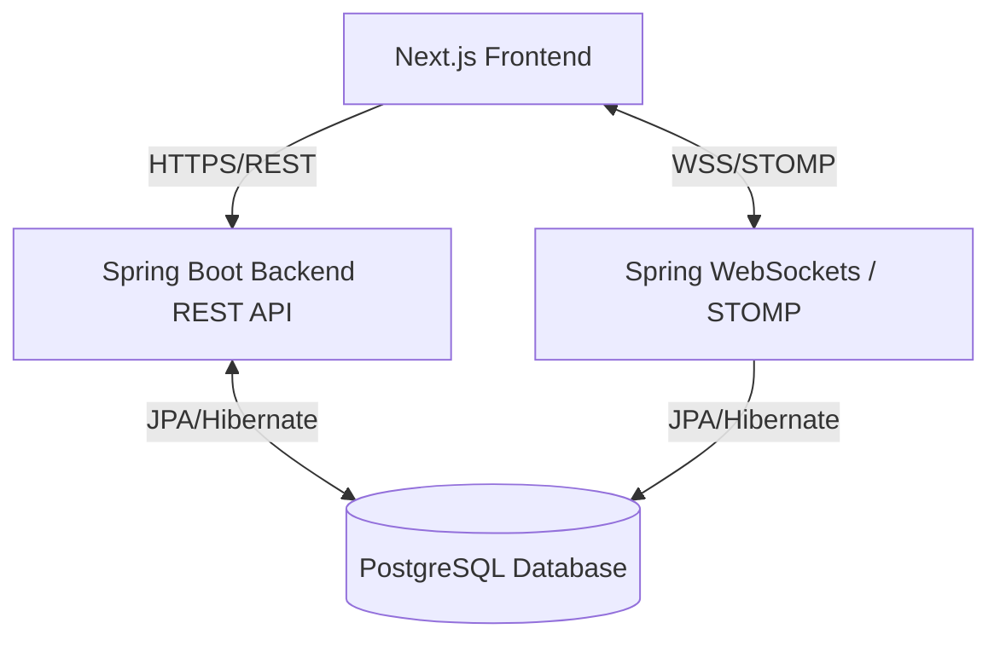
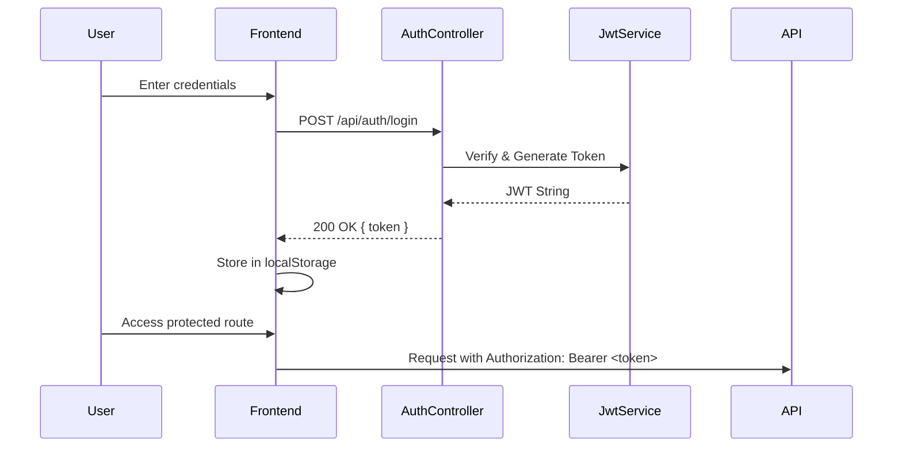
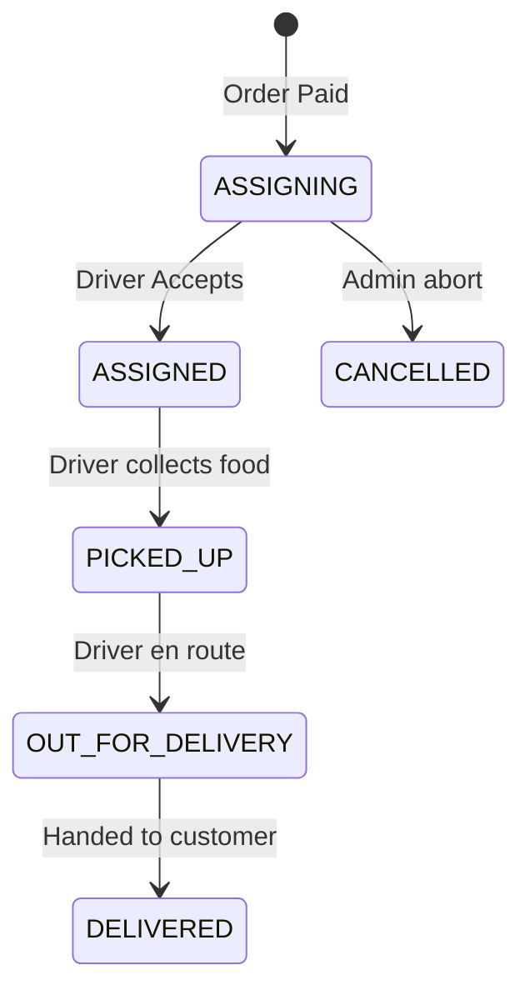
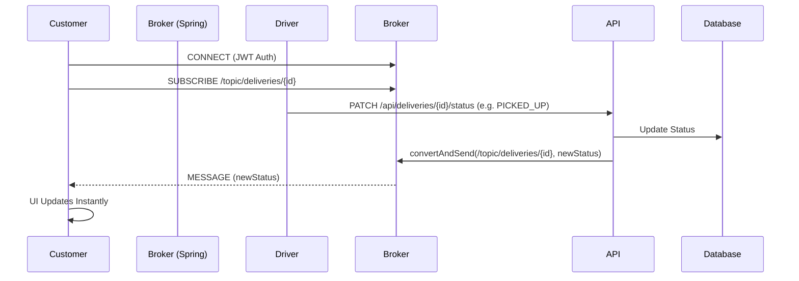

# QuickBite Architecture

## High-Level Architecture
QuickBite is designed as a modular monolith (Spring Boot) serving a decoupled Single Page Application (Next.js).

## Security & JWT Authentication Flow
We use a stateless JWT (JSON Web Token) approach.

*Note: We extract the `customerId` entirely from the JWT payload to prevent IDOR.*

## Customer Order Flow
1. **Browse:** Customer browses `GET /api/restaurants`.
2. **Cart:** Customer adds items.
3. **Checkout:** Customer hits `POST /api/orders` to create a `PENDING` order.
4. **Payment:** Customer pays via Razorpay (`POST /api/payments/verify`).
5. **Confirmation:** Backend verifies the payment signature, marks order `CONFIRMED`, and automatically initializes the Delivery lifecycle.

## Delivery Workflow
Once an order is paid, the system automatically spawns a Delivery record.

## WebSocket Real-Time Status Flow
Instead of polling the server, customers receive updates instantly.

## Restaurant Onboarding Flow
To support growth safely, restaurants go through a vetting process.
- **Flow A (New Restaurant):** `POST /api/restaurants/apply` -> Status is `PENDING_APPROVAL`.
- **Flow B (Join Existing):** `POST /api/restaurants/{id}/staff-requests` -> Creates `RestaurantStaffProfile` with status `PENDING_APPROVAL`.
- **Visibility:** Queries strictly filter by `status IS NULL OR status = 'APPROVED'`, meaning pending applications remain invisible to public customers.

## Current Limitations
- **No Map UI:** GPS locations are collected but not currently rendered on a live map interface.
- **Monolith:** The backend is currently a single Spring Boot application. It is well-structured for future microservice extraction but is monolithic today.
- **Stateless WebSockets:** We currently use Spring's SimpleBroker. In a multi-instance deployment, this must be swapped for an external broker (like Redis or RabbitMQ) to share topics across instances.
